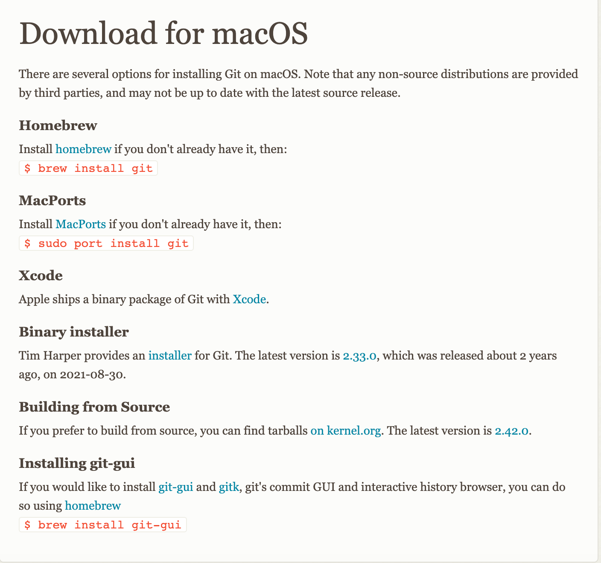
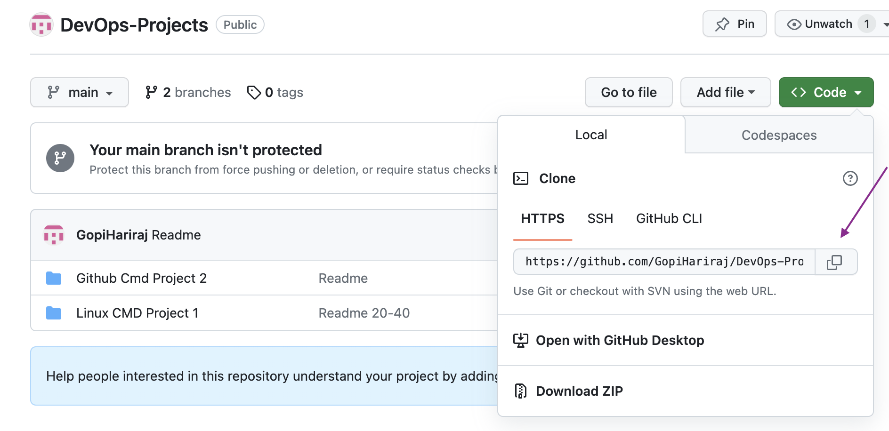
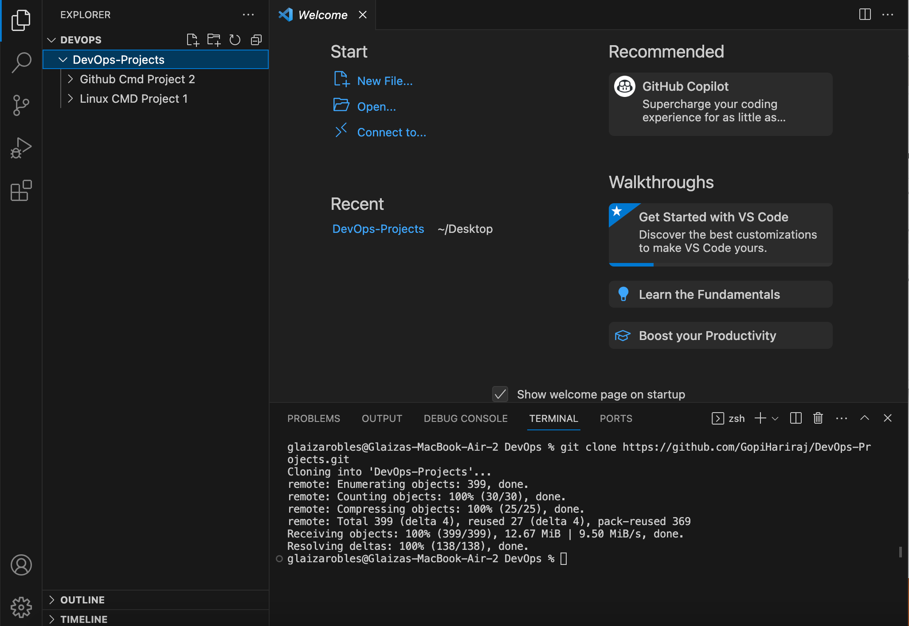

                                                     GIT PROJECT

# Introduction
   Git is a powerful, open-source version control system that has become an essential tool in the software development industry. Initially developed by Linus Torvalds, the creator of Linux, Git was designed to address the need for efficient source code management in large collaborative projects. Over time, it has gained widespread adoption and is now utilized by a vast number of software companies and individual developers alike..
# Requirements:
   To effectively utilize Git for Source Version Control (SVC) and Source Versioning System (SVS) operations, several key requirements should be considered:

# GIT Installtion Setps

Git Installation: Ensure that Git is installed on your development environment. Git provides official downloads and installation instructions for various operating systems on its website (https://git-scm.com/).

**Step 1**

  Install Github for mac os
  

**Step 2**

  Install VScode
  
  

  Download a VScode from below link
  https://code.visualstudio.com/download

  Find a operating system download a VScode tool
  
  

**Step 3**

  Create a GitHub account 

  # Register a account
  
  
 
  # Verify a email account

  

  # Open a Githug account and create a new repository

  

  # Copy the Code of the repository 

   

  
**Step 4**

  Run a VScode code 

  

  * Open a new folder
  * Open terminal (Shortcut Ctrl + ~ )
  * Run a command Git clone "git clone copy url link"
  * packets will download to local repository.

**Git commands**
  Use VScode tool Add, commit, push, Branch, Logs 

# GIT Working module

# GIT and GitHub Concultion
                                 
                          
1) It is installed locally on the system 
2) Git is manitain by Linux
3) Git can manage source code entire History  
4) NO managment futures                 
5) Open Source LIcense 

1) GitHub is the service hosted on the web Exclusivly CLoud Based
2) Github is own by Microsoft
3) Hosting service of github repository
4) Built in user management Future
5) Free Tier and pay for use tier