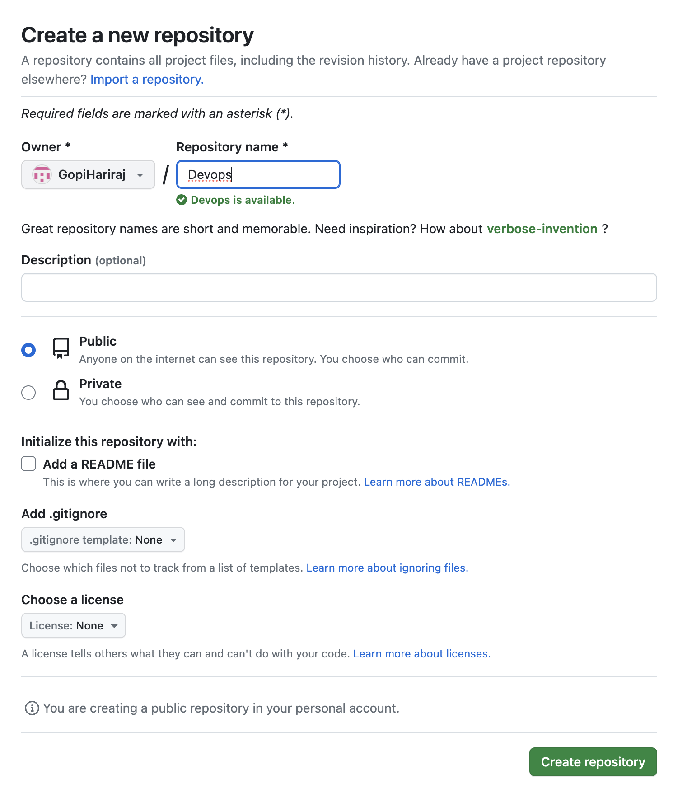

                                                     GIT PROJECT

# Introduction
   Git is a powerful, open-source version control system that has become an essential tool in the software development industry. Initially developed by Linus Torvalds, the creator of Linux, Git was designed to address the need for efficient source code management in large collaborative projects. Over time, it has gained widespread adoption and is now utilized by a vast number of software companies and individual developers alike..
# Requirements:
   To effectively utilize Git for Source Version Control (SVC) and Source Versioning System (SVS) operations, several key requirements should be considered:

# GIT Installtion Setps

Git Installation: Ensure that Git is installed on your development environment. Git provides official downloads and installation instructions for various operating systems on its website (https://git-scm.com/).

**Step 1**

  Install Github for mac os
  

**Step 2**

  Install VScode
  
  

  Download a VScode from below link
  https://code.visualstudio.com/download

  Find a operating system download a VScode tool
  
  

**Step 3**

  Create a GitHub account 

  
  # Register a account
  
  
 
 
 
  # Verify a email account

  

 
 
  # Open a Github account and create a new repository

  

  
  
  # Copy the Code of the repository 

   

  
**Step 4**

  # Run a VScode code 

  

  * Open a new folder
  * Open terminal (Shortcut Ctrl + ~ )
  * Run a command Git clone "git clone copy url link"
  * System will verify github login popup

  * Packets will download to local repository.

  # Git commands
    
    > Git Add "File name"

    > Git commit -m "Message"

    > Git push origin main

    > Git Status

    > Git Log

    > Git pull

    
    
 # Branches and Merging

**Create new project local repositore Git-project**

 >cd Git-project
  
 >git init
  
Creat a two local fils commit it
   

**local repo file connect to github remote repositore**

Create new repositore in same name at Github

Once created github repo follow below setup to like a local repo

>git remote add https://https://github.com/GopiHariraj/Git-project.git

 Fils are update in the github repository

# Branch

Create a branch in the repository

Name = Gitbranch1
 

**Checking a available branch in local repository**

>Git Pull

To find a available branch

>Git branch -a

**Checkout to other branch**

>git cheakout "branch name"

Creat new file in gitbranch1

**Checkout to main**

We see the different fill will not show in the main branch repository

**Find a differance between main branch and gitbranch1**

>git diff

# Merge

**Now gitbranc1 file push the file to main branch**

This file will available on local only we need push to github

>git push origin main

**output**

Github main

Github Branch

# GIT Working module

**Repository Hosting:** Decide where you'll host your Git repositories. Popular options include GitHub, GitLab, Bitbucket, and self-hosted solutions. Choose a hosting platform that aligns with your project's security, collaboration, and accessibility needs.

**Collaboration Workflow:** Define a Git workflow that suits your team's needs. Common workflows include Gitflow, GitHub Flow, and GitLab Flow. Understanding and implementing a workflow ensures smooth collaboration and code management.

**Integration:** Consider integrating Git with other development tools, such as continuous integration/continuous deployment (CI/CD) pipelines, issue tracking systems, and code review platforms, to streamline your development workflow.

**Backup and Recovery:** Implement regular backup and recovery procedures for your Git repositories. This ensures that you can recover your code in case of accidental data loss or corruption.

# GIT and GitHub Conclusion
                                 
                          
1) It is installed locally on the system 
2) Git is manitain by Linux
3) Git can manage source code entire History  
4) NO managment feature                 
5) Open Source LIcense 

1) GitHub is the service hosted on the web Exclusivly CLoud Based
2) Github is own by Microsoft
3) Hosting service of github repository
4) Built in user management Feature
5) Free Tier and pay for use tier

[def]: Images/Push.png

# Host a website with git

Step 1 

Create new repository and add index.html file

Step 2

1) In repository setting option select a page
2) Branch option change to main
3) Save the changes 
4) Refreash the page site link will appear on top of the page

Click the link the page will open

