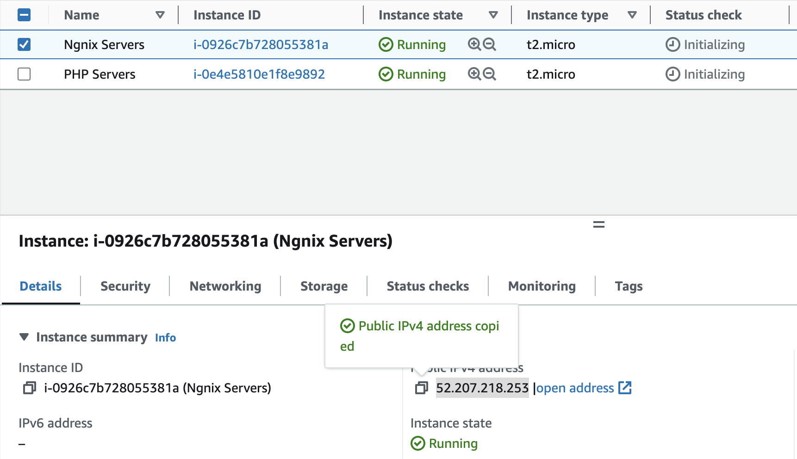

                                LAMP Project                    

# Introduction

LAMP (Linux, Apache, MySQL, PHP or Python, or Perl)
LEMP (Linux, Nginx, MySQL, PHP or Python, or Perl)
MERN (MongoDB, ExpressJS, React JS, NodeJS)
MEAN (MongoDB, ExpressJS, Angular JS, NodeJS
# Requirments
  1) AWS
  2) nginx
  3) mysql
  4) php

# Web stack Implementatoin

**Create a AWS Instance**
Login to the AWS account and select EC2 service

1) Tag ame of the server
2) select server (AMI) Exampl: Ubuntu,Amazon linux
3) testing perpose make sure Free tier eligible

1) Key pair recommed to connecta EC2 instant secure
2) Network setting use to create default vpc snd subnet
3) fireall alloew ssh anf HTTP

In ec 2 instant we can find server ip, to select a instance ip detail will be show on down.

copy that ip connect to the instance with termius tool.

**Termius server lanch**

1) click a new host option
2) select an edit tool
3) In the right-sidebar configure a server name(lable),ip address,add a KEY which we download from AWS.
4) add a KEY which we download from AWS.

Then right click and connect to the server system

**Install NGINX server**

**Install MYSQL**

**Install PHP**

**Host a website with git**