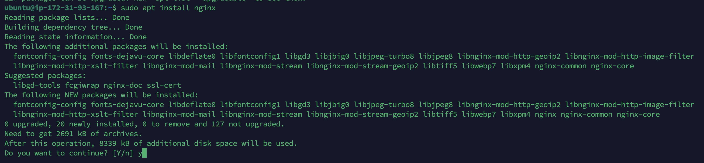
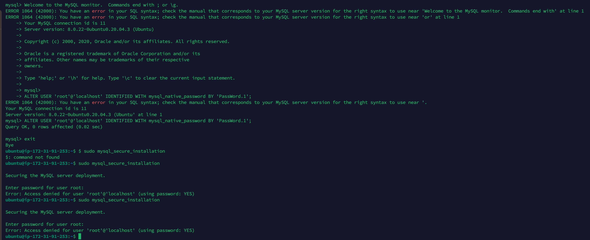

                                LAMP Project                    

# Introduction

LAMP (Linux, Apache, MySQL, PHP or Python, or Perl)
LEMP (Linux, Nginx, MySQL, PHP or Python, or Perl)
MERN (MongoDB, ExpressJS, React JS, NodeJS)
MEAN (MongoDB, ExpressJS, Angular JS, NodeJS
# Requirments
  1) AWS
  2) nginx
  3) mysql
  4) php

# Web stack Implementatoin

**Create a AWS Instance**
Login to the AWS account and select EC2 service

1) Tag ame of the server
2) select server (AMI) Exampl: Ubuntu,Amazon linux
3) testing perpose make sure Free tier eligible

Recommed to create new key pair 

1) Key pair recommed to connecta EC2 instant secure
2) Network setting use to create default vpc snd subnet
3) fireall alloew ssh anf HTTP

In ec 2 instant we can find server ip, to select a instance ip detail will be show on down.

copy that ip connect to the instance with termius tool.

**Termius server lanch**

1) click a new host option
2) select an edit tool
3) In the right-sidebar configure a server name(lable),ip address,add a KEY which we download from AWS.
4) add a KEY which we download from AWS.

Then select the host, right click and connect to the server system

# Install NGINX server

Introduction:-

Server terminal is launched successfully

Step 1) We need update server first

> sudo apt update -y

-y flag it to proceed update a syatem

step 2) Install a Nginx software

> sudo apt install Nginx

Step 3) Request Nginx on Port 80

>curl http://127.0.0.1:80)

Before testing a nginx web page we need to enable a inbound rule port 80 should be add

1) Select an EC2 instance
2) got to security option
3) select scurity id (E.g s9-0c59dd51d333ec66 - launch-wizard-1)
4) edit and add rule
5) save rules

Test a site copied public ip past in web browser. it will launch our nginx server 

Nginx server default index location is 

if we change a index it will reflect on web browser

# Install an Apache server

After AWS server launch

Step 1)
Update a server system

 >sudo apt update -y

Step 2)
Install an apache server

 >sudo apt install apache2 

sept 3)

>curl://127.0.0.1:80)
 
Step 4)

Before testing a nginx web page we need to enable a inbound rule port 80 should be add

1) Select an EC2 instance
2) got to security option
3) select scurity id (E.g s9-0c59dd51d333ec66 - launch-wizard-1)
4) edit and add rule
5) save rules

Test a site copied public ip past in web browser. it will launch our Apache server 

Apach server default index location at /var/www/html/index.html)

**apahe server how to change a index? reflect in web browser**

Step 1)

Remove the index file from default location

> cd /var/www/html/
> Sudo rm Index.html

Step 2)

Create a new index.html file in that loaction

> sudo touch index.html

Step 3) 

edit a file with VI cmd

> sudo vi index.html

Step 4)

press "i" insert option will enable

Write a script in the index document

Step 5)

Press "esc"

type: :wq!

Press "enter"

File will wright and save.

Now open a same ip address it new index file will reflect on browser

# Install MYSQL

**Introduction**

Step 1)

>sudo apt-install mysql-server

Step 2)

Connect to Mysql administative root database

>suso mysql

Welcome to the MySQL monitor.  Commands end with ; or \g.
Your MySQL connection id is 11
Server version: 8.0.22-0ubuntu0.20.04.3 (Ubuntu)

Copyright (c) 2000, 2020, Oracle and/or its affiliates. All rights reserved.

Oracle is a registered trademark of Oracle Corporation and/or its
affiliates. Other names may be trademarks of their respective
owners.

Type 'help;' or '\h' for help. Type '\c' to clear the current input statement.

mysql> 

mysql>ALTER USER 'root'@'localhost' IDENTIFIED WITH mysql_native_password BY 'PassWord.1';
mysql>exit

Step 3)

start a interactive script

>sudo mysql_secure_installation

Enter the valid password: 'PassWord.1'

After given yse to all

Mysql Data base installation is completed

# Install PHP

You have Apache installed to serve your content and MySQL installed to store and manage your data. PH is the component of our setup that will process code to display dynamic content to the end user. In addition to the php package, you'll need php-mysql, a PHP module that allows PH to communicate with MySQL-based databases. You'll also need libapache2-mod-php to enable
Apache to handle PHP files. Core PHP packages will automatically be installed as dependencies.
To install these 3 packages at once, run:

>sudo apt install php libapache2-mod-php php-mysql

>php -v

output:-
PHP 7.4.3 (cli) (built: Oct  6 2020 15:47:56) ( NTS )
Copyright (c) The PHP Group
Zend Engine v3.4.0, Copyright (c) Zend Technologies

**Enable PHP on the website**

>sudo vim /etc/apache2/mods-enabled/dir.conf

To verify a script in the dir.conf file

<IfModule mod_dir.c>
        #Change this:
        #DirectoryIndex index.html index.cgi index.pl index.php index.xhtml index.htm
        #To this:
        DirectoryIndex index.php index.html index.cgi index.pl index.xhtml index.htm
</IfModule>

Reloade system apache

>sudo systemctl reload apache2

Creat index.php file

>cd /var/www/html

>sudo rm index.html

>sudo touch index.php

>sudo vi index.php

copy the below  script in the document

<?php
phpinfo();

Project Reference: https://www.digitalocean.com/community/tutorials/how-to-install-linux-apache-mysql-php-lamp-stack-on-ubuntu-20-04#step-3-%E2%80%94-installing-php

# Host a website with git