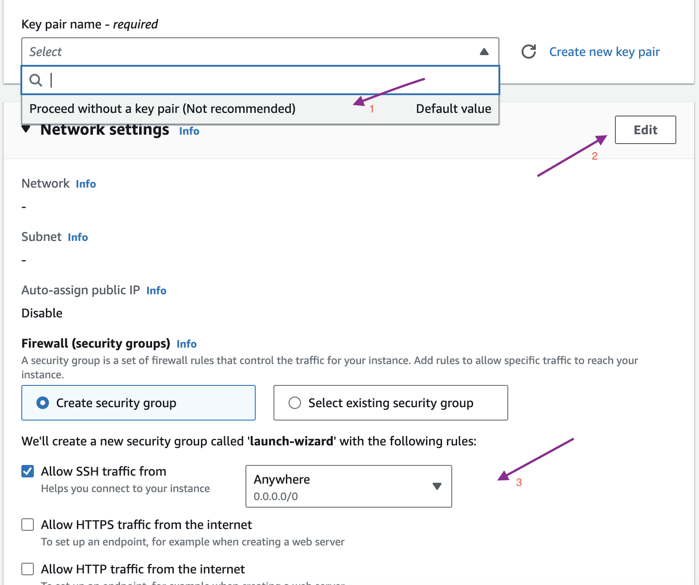
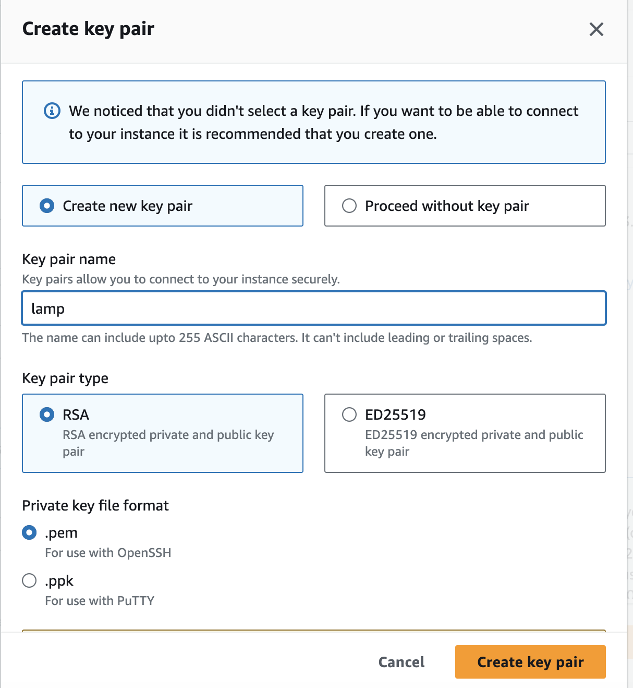
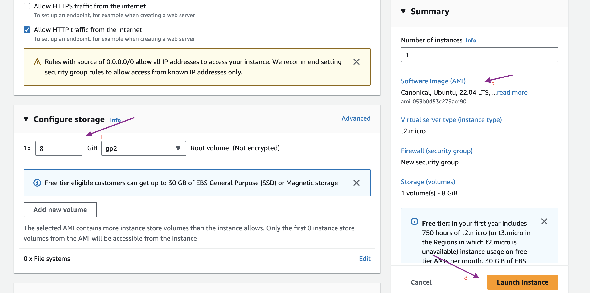
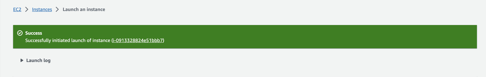
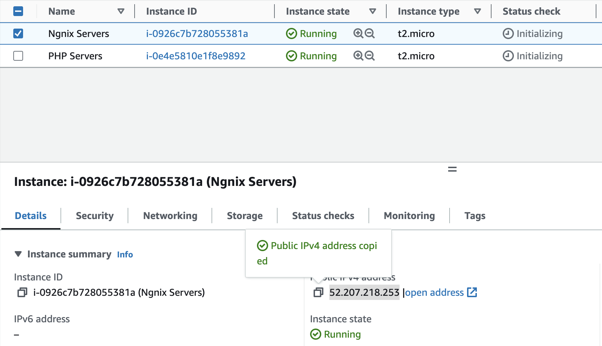
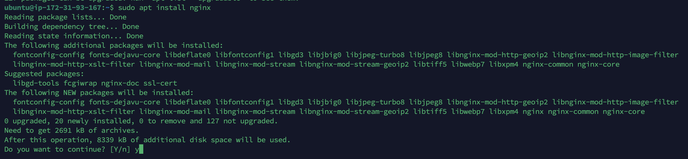

                                                                        LEMP Project
# Requirments for LAMP Project
  1) AWS EC2 Instance
  2) nginx secver
  3) mysql database
  4) php

# Web stack Implementatoin

**Create a AWS Instance**

Login to the AWS account and select EC2 service

1) Tag name of the server
2) select server (AMI) Exampl: Ubuntu,Amazon linux
3) Testing perpose make sure Free tier eligible

Recommed to create new key pair 

1) Key pair recommed to connecta EC2 instant secure
2) Network setting use to create default vpc snd subnet
3) firewall allow ssh and HTTP

1) Configure storage 
2) Find a Summery of the EC2 instance specification.
3) launch an instance

Below Screen we can confirm Instance successfully run

In EC2 instant we can find server ip, to select a instance ip detail will be show on down.

copy that ip connect to the instance with termius tool.

**Termius server lanch**

Open a Termius application 

Conect to the EC2 Instance

1) Click a new host option
2) Select an edit tool
3) In the right-sidebar configure a server name(lable),ip address,add a KEY which we download from AWS.
4) Add a KEY which we download from AWS.

Then select the host. Right click and connect to the server system

# Install NGINX server

Introduction:-
Nginx (pronounced "engine-x") is a highly popular open-source web server, reverse proxy server, load balancer, and HTTP cache. It is known for its high performance, scalability, and reliability, making it a popular choice for serving web content, managing application traffic, and improving the performance and security of web applications

Server terminal is launched successfully

Step 1) We need to update server first

> sudo apt update -y

-y flag it to proceed update a syatem

step 2) Install a Nginx software

> sudo apt install Nginx

Step 3) Request Nginx on Port 80

>curl http://127.0.0.1:80)

Before testing a nginx web page we need to enable a inbound rule port 80 should be add

1) Select an EC2 instance
2) Go to security option
3) Select scurity id (E.g s9-0c59dd51d333ec66 - launch-wizard-1)
4) Edit and add rule
5) Save rules

Test a site copied public ip past in web browser. it will launch our nginx server 

Nginx server default index location is

if we change a index it will reflect on web browser
ok