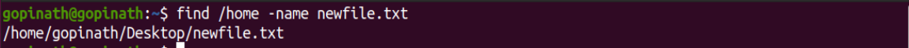
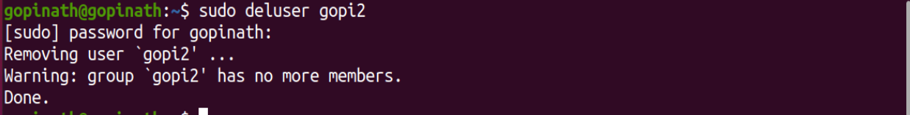
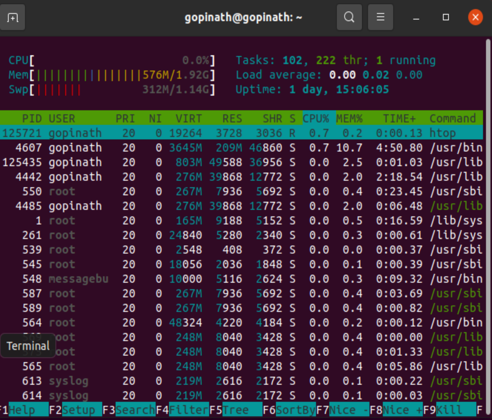

                                                     LINUX COMMAND 

# Project 01

Linux commend
Linux is a family of open-source Unix operating systems based on the Linux kernel. They include Ubuntu, Fedora, Debian, OpenSUSE, and Red Hat. In this project, we used a VirtualBox virtual machine to install Ubuntu 20.04 LTS version and ran shell commands on the Ubuntu terminal.

When operating Linux, you need to use a shell - a program that gives you access to the operating system. Most of the Linux distributions use a graphical user interface (GUI). However, others utilize the command-line interface (CLI).

Tasks that require multiple steps on the GUI can be done in a matter of seconds by entering commands into the CLI.

**Prerequirments:-**

1)Windows are MAC operating system

2)Virtual box

3)Ubuntu Operating system

**1)Sudo command**

sudo is commonly used to run a command as root.

Syntax
> sudo apt update

**2)Pwd Commend**

Print working directory 

Syntax
> pwd

**3)cd Command**

change directory location

Syntax
> cd

**4)ls Command**

List (listof the file)

Syntax
> ls

gopinath@gopinath:~$ ls -lh

Syntax
>ls -lh

**5)cat command**

Showing file content

Syntax
> cat "File name"

**6)cp command**

Coping a file using command

Syntax
> cd "file name" /Distination Directory/

**7)mv command**

Moving file from one place to another location.

Syntax
> mv "file name" /Distination location/

**8)mkdir**

Make directory file

Syntax
> mkdir "filename"

**9)rmdir**

Removing directory file 

Syntax
>rmdir "directory name"

**10)rm**

Removing file name

Syntax
>rm "file name"

**11) Touch**

You can create an empty file using

Command
> touch "file name"

**12) Locate -i**
gopinath@gopinath:~$ locate -i school*note

**13)Find Command**

Finding file loction
>find "file name"

gopinath@gopinath:~$ find /home -name sqlite_command.sh 
/home/gopinath/sqlite_command.sh

**14) grep command**

grep is chasing a perticular operation or funtion
>grep "operation"

gopinath@gopinath:~$ grep sqlite_command.sh 

**15) df command**

Define all file size 
Command
>df      
and 
>df -h

-h human best understanding way define

**16) du command**
How many files and storage are taken in the directory

Command
>du

gopinath@gopinath:~$ du /home/gopinath/Unix_Command/
8	/home/gopinath/Unix_Command/

**17) Head Command**

Find the header of the document file
>head "file name"

**18) tail command**

Find the lower lins of the document files

Command
>tail "file name"

**19)diff command**

Differance between two documents command lines

Commands
>diff "file name1" "file name2"

gopinath@gopinath:~$ cat Sql.yml 
---
Show the script lines in the document file

Command
>cat "file name"

tar command

archive the tar file single mount to the multiple files

Command
>tar -cvf "filename.tar" /directory file name

Extracting and showing inside the tar files

Command
>tar -xvf "filename.tar"

**21)chmod command**

File read and writh permission change

Command
>chmod 777 "file name"

**22)chown**

**23)Jobs jobID**

**24)KILL**
Show all processing file with PID 

Command
>ps ux

Command
>KILL SIGKILL PID

25) ping command

Ping used to find conectivity in the network devices

Command
>pind "IP Address"

**26) wget command**

Command used to download file from link or directory

Command 
>wget "linK url"

**27)uname command**

Find name of the operating system

Command
>uname -a

**28)top command**

gopinath@gopinath:~$ top

Continuse system process 

Command 
>top

**29)history**

History of bash command

Command
>history

**30) man command**

Manul of commands

Syntax
> man "command"

#gopinath@gopinath:~$ man chown

CHOWN(1)                                                      User Commands                                                     CHOWN(1)

NAME
       chown - change file owner and group

SYNOPSIS
       chown [OPTION]... [OWNER][:[GROUP]] FILE...
       chown [OPTION]... --reference=RFILE FILE...

DESCRIPTION
       This  manual page documents the GNU version of chown.  chown changes the user and/or group ownership of each given file.  If only
       an owner (a user name or numeric user ID) is given, that user is made the owner of each given file, and the files' group  is  not
       changed.  If the owner is followed by a colon and a group name (or numeric group ID), with no spaces between them, the group own‐
       ership of the files is changed as well.  If a colon but no group name follows the user name, that user is made the owner  of  the
       files and the group of the files is changed to that user's login group.  If the colon and group are given, but the owner is omit‐
       ted, only the group of the files is changed; in this case, chown performs the same function as chgrp.  If only a colon is  given,
       or if the entire operand is empty, neither the owner nor the group is changed.

OPTIONS
       Change  the  owner and/or group of each FILE to OWNER and/or GROUP.  With --reference, change the owner and group of each FILE to
       those of RFILE.

       -c, --changes
              like verbose but report only when a change is made

       -f, --silent, --quiet
              suppress most error messages

       -v, --verbose
              output a diagnostic for every file processed

       --dereference
              affect the referent of each symbolic link (this is the default), rather than the symbolic link itself

       -h, --no-dereference
              affect symbolic links instead of any referenced file (useful only on systems that can change the ownership of a symlink)

       --from=CURRENT_OWNER:CURRENT_GROUP
              change the owner and/or group of each file only if its current owner and/or group match those specified here.  Either  may
              be omitted, in which case a match is not required for the omitted attribute

       --no-preserve-root
              do not treat '/' specially (the default)

       --preserve-root
              fail to operate recursively on '/'

       --reference=RFILE
              use RFILE's owner and group rather than specifying OWNER:GROUP values

       -R, --recursive
              operate on files and directories recursively

       The  following  options modify how a hierarchy is traversed when the -R option is also specified.  If more than one is specified,
       only the final one takes effect.

       -H     if a command line argument is a symbolic link to a directory, traverse it

       -L     traverse every symbolic link to a directory encountered

       -P     do not traverse any symbolic links (default)

       --help display this help and exit

       --version
              output version information and exit
 Manual page chown(1) line 1 (press h for help or q to quit)

**31) echo**
Echo the file name

Command
>echo "name"

**32) unzip**

**33)hostname**

Current host name will show

Command
> hostname

**34)adduser deluser**

Add a newuser in the system

Command
>sudo adduser "name"

Login to the user account

Command
> su "user account"

Chang password of the user

Command
>passwd

Delete the user account

Command
>sudo deluser "user account"

**35)apt-get** 
Install application used to apt-get command

Command
>sudo apt-get install "name" -y

command
> sudo apt-get install vlc

**36)Nano,vi**

 command
>vi "file name.sh"

gopinath@gopinath:~$ nano firstfile1.txt
gopinath@gopinath:~$ vi secondfile2.sh
gopinath@gopinath:~$ nano firstfile1.txt
gopinath@gopinath:~$ cat firstfile1.txt 
first file project1
gopinath@gopinath:~$ cat secondfile2.sh 
test

**37)alias,unalias** 
Creating a shortcut key for the command

command
>alias r=clear

**38) Su**

Use to login to the user

 command
> su "user name"

While you're logged in to the terminal shell with one
user, you might have the need to switch to another
user.

gopinath@gopinath:~$ sudo su Linuxuser2
$ whoami
Linuxuser2

**39) htop**
Task manger of running application

A quick guide to the top command, used to list the
processes running in real time

command
> htop

**40) ps command**

This is the list of user-initiated processes currently
running in the current session.

Syntax

> ps

gopinath@gopinath:~$ ps
    PID TTY          TIME CMD
  11776 pts/0    00:00:00 bash
  12506 pts/0    00:00:00 htop
  12526 pts/0    00:00:00 ps

**41) Chomd Command**
ugo
u - users
g - group
o - others
rwx
r - read - 4
w - write - 2
XI - execute - 1
r-x, rw-, r- - server. sh

>chmod 400 "file name"

>chmod 777 "file name"