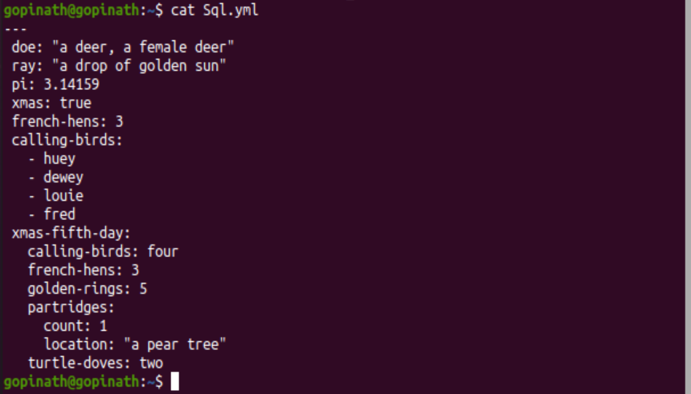

                                                     LINUX COMMAND 

# Project 01

Linux commend
Linux is a family of open-source Unix operating systems based on the Linux kernel. They include Ubuntu, Fedora, Debian, OpenSUSE, and Red Hat. In this project, we used a VirtualBox virtual machine to install Ubuntu 20.04 LTS version and ran shell commands on the Ubuntu terminal.

When operating Linux, you need to use a shell - a program that gives you access to the operating system. Most of the Linux distributions use a graphical user interface (GUI). However, others utilize the command-line interface (CLI).

Tasks that require multiple steps on the GUI can be done in a matter of seconds by entering commands into the CLI.

**Prerequirments:-**

1)Windows are MAC operating system

2)Virtual box

3)Ubuntu Operating system

**1)Sudo command**

sudo is commonly used to run a command as root.

Syntax
> sudo apt update

**2)Pwd Commend**

Print working directory 

Syntax
> pwd

**3)cd Command**

change directory location

Syntax
> cd

**4)ls Command**

List (listof the file)

Syntax
> ls

gopinath@gopinath:~$ ls -lh

Syntax
>ls -lh

**5)cat command**

Showing file content

Syntax
> cat "File name"

**6)cp command**

Coping a file using command

Syntax
> cd "file name" /Distination Directory/

**7)mv command**

Moving file from one place to another location.

Syntax
> mv "file name" /Distination location/

**8)mkdir**

Make directory file

Syntax
> mkdir "filename"

**9)rmdir**

Removing directory file 

Syntax
>rmdir "directory name"

**10)rm**

Removing file name

Syntax
>rm "file name"

**11) Touch**

You can create an empty file using

Command
> touch "file name"

**12) Locate -i**
gopinath@gopinath:~$ locate -i school*note

**13)Find Command**

Finding file loction
>find "file name"

gopinath@gopinath:~$ find /home -name sqlite_command.sh 
/home/gopinath/sqlite_command.sh

**14) grep command**

grep is chasing a perticular operation or funtion
>grep "operation"

gopinath@gopinath:~$ grep sqlite_command.sh 

**15) df command**

Define all file size 
Command
>df      
and 
>df -h

-h human best understanding way define

**16) du command**
How many files and storage are taken in the directory

Command
>du

gopinath@gopinath:~$ du /home/gopinath/Unix_Command/
8	/home/gopinath/Unix_Command/

**17) Head Command**

Find the header of the document file
>head "file name"

**18) tail command**

Find the lower lins of the document files

Command
>tail "file name"

**19)diff command**

Differance between two documents command lines

Commands
>diff "file name1" "file name2"

gopinath@gopinath:~$ cat Sql.yml 
---
Show the script lines in the document file

Command
>cat "file name"

tar command

archive the tar file single mount to the multiple files

Command
>tar -cvf "filename.tar" /directory file name

Extracting and showing inside the tar files

Command
>tar -xvf "filename.tar"

**21)chmod command**

File read and writh permission change

Command
>chmod 777 "file name"

**22)chown**

**23)Jobs jobID**

**24)KILL**
Show all processing file with PID 

Command
>ps ux

Command
>KILL SIGKILL PID

25) ping command

Ping used to find conectivity in the network devices

Command
>pind "IP Address"

gopinath@gopinath:~$ ping 8.8.8.8
PING 8.8.8.8 (8.8.8.8) 56(84) bytes of data.
64 bytes from 8.8.8.8: icmp_seq=1 ttl=63 time=18.1 ms
64 bytes from 8.8.8.8: icmp_seq=2 ttl=63 time=14.4 ms
64 bytes from 8.8.8.8: icmp_seq=3 ttl=63 time=30.3 ms
64 bytes from 8.8.8.8: icmp_seq=4 ttl=63 time=15.8 ms

**26) wget command**

gopinath@gopinath:~$ wget www.google.com
--2023-09-03 21:05:57--  http://www.google.com/
Resolving www.google.com (www.google.com)... 216.239.38.120, 2001:4860:4802:32::78
Connecting to www.google.com (www.google.com)|216.239.38.120|:80... connected.
HTTP request sent, awaiting response... 200 OK
Length: unspecified [text/html]
Saving to: ‘index.html’

index.html                             [ <=>                                                             ]  21.05K  --.-KB/s    in 0.01s   

2023-09-03 21:05:58 (1.99 MB/s) - ‘index.html’ saved [21558]

**27)uname command**

gopinath@gopinath:~$ uname -a
Linux gopinath 5.15.0-82-generic #91~20.04.1-Ubuntu SMP Fri Aug 18 16:24:39 UTC 2023 x86_64 x86_64 x86_64 GNU/Linux
gopinath@gopinath:~$ uname -s
Linux
gopinath@gopinath:~$ uname -n
gopinath

**28)top command**

gopinath@gopinath:~$ top

top - 21:09:20 up 36 min,  1 user,  load average: 0.13, 0.34, 0.30
Tasks: 178 total,   1 running, 176 sleeping,   1 stopped,   0 zombie
%Cpu(s):  1.0 us,  0.3 sy,  0.0 ni, 98.7 id,  0.0 wa,  0.0 hi,  0.0 si,  0.0 st
MiB Mem :   1964.1 total,    170.4 free,   1132.8 used,    660.9 buff/cache
MiB Swap:   1162.4 total,   1159.7 free,      2.8 used.    633.6 avail Mem 

    PID USER      PR  NI    VIRT    RES    SHR S  %CPU  %MEM     TIME+ COMMAND                                                              
   4442 gopinath  20   0  341488 147144  89056 S   2.4   7.3   0:28.70 Xorg                                                                 
   4607 gopinath  20   0 3740000 378932 145204 S   2.4  18.8   0:40.42 gnome-shell                                                          
   5059 gopinath  20   0  824212  51924  38720 S   0.6   2.6   0:02.39 gnome-terminal-                                                      
   5130 gopinath  20   0 3518232 362388 167152 S   0.6  18.0   0:33.60 firefox                                                              
   5268 gopinath  20   0 2558192 188292  97144 S   0.6   9.4   0:16.59 Isolated Web Co                                                      
   4382 root      20   0       0      0      0 I   0.3   0.0   0:02.47 kworker/0:3-events                                                   
      1 root      20   0  168088  11084   8500 S   0.0   0.6   0:01.51 systemd                                                              
      2 root      20   0       0      0      0 S   0.0   0.0   0:00.00 kthreadd                                                             
      3 root       0 -20       0      0      0 I   0.0   0.0   0:00.00 rcu_gp                                                               
      4 root       0 -20       0      0      0 I   0.0   0.0   0:00.00 rcu_par_gp                                                           
      5 root       0 -20       0      0      0 I   0.0   0.0   0:00.00 slub_flushwq                                                         
      6 root       0 -20       0      0      0 I   0.0   0.0   0:00.00 netns                                                                
      8 root       0 -20       0      0      0 I   0.0   0.0   0:00.00 kworker/0:0H-events_highpri                                          
     10 root       0 -20       0      0      0 I   0.0   0.0   0:00.00 mm_percpu_wq                                                         
     11 root      20   0       0      0      0 S   0.0   0.0   0:00.00 rcu_tasks_rude_  

**29)history**

gopinath@gopinath:~$ history
    1  sudo useradd
    2  useradd Linuxuser1
    3  sudo useradd Linuxuser1
    4  passwd pass4321
    5  passwd Linuxuser1 pass4321
    6  useradd Linuxuser1
    7  passwd
    8  login Linuxuser1
    9  Linuxuser1
   10  ls
   11  sudo passed Linuxuser1
   12  sudo passwd Linuxuser1
   13  whoami
   14  sudo Linuxuser
   15  sudo Linuxuser1
   16  sudo su Linuxuser1
   17  chown Project_a Linuxuser1
   18  ls
   19  sudo chown Project_a Linuxuser1
   20  sudo chown Linuxuser1 Project_A
   21  sudo chown Linuxuser1 Project_a
   22  sudo chown Linuxuser1 \home\gopinath\Project_a
   23  ls
   24  clear
   25  man chown
   26  ls
   27  chown Linuxuser1 sql.yml
   28  chown gopinath sql.yml
   29  chown gopinath /home/gopinth/sql.yml
   30  sudo chown gopinath /home/gopinth/sql.yml
   31  sudo chown Linuxuser1 /home/gopinth/sql.yml
   32  ps ux
   33  clear
   34  jobs jobID
   35  jobs jobid
   36  ping 8.8.8.8
   37  wget www.google.com
   38  unname -a
   39  uname -a
   40  uname -s
   41  uname -n
   42  top
   43  clear
   44  history

**30) man command**

Syntax
> man "command"

#gopinath@gopinath:~$ man chown

CHOWN(1)                                                      User Commands                                                     CHOWN(1)

NAME
       chown - change file owner and group

SYNOPSIS
       chown [OPTION]... [OWNER][:[GROUP]] FILE...
       chown [OPTION]... --reference=RFILE FILE...

DESCRIPTION
       This  manual page documents the GNU version of chown.  chown changes the user and/or group ownership of each given file.  If only
       an owner (a user name or numeric user ID) is given, that user is made the owner of each given file, and the files' group  is  not
       changed.  If the owner is followed by a colon and a group name (or numeric group ID), with no spaces between them, the group own‐
       ership of the files is changed as well.  If a colon but no group name follows the user name, that user is made the owner  of  the
       files and the group of the files is changed to that user's login group.  If the colon and group are given, but the owner is omit‐
       ted, only the group of the files is changed; in this case, chown performs the same function as chgrp.  If only a colon is  given,
       or if the entire operand is empty, neither the owner nor the group is changed.

OPTIONS
       Change  the  owner and/or group of each FILE to OWNER and/or GROUP.  With --reference, change the owner and group of each FILE to
       those of RFILE.

       -c, --changes
              like verbose but report only when a change is made

       -f, --silent, --quiet
              suppress most error messages

       -v, --verbose
              output a diagnostic for every file processed

       --dereference
              affect the referent of each symbolic link (this is the default), rather than the symbolic link itself

       -h, --no-dereference
              affect symbolic links instead of any referenced file (useful only on systems that can change the ownership of a symlink)

       --from=CURRENT_OWNER:CURRENT_GROUP
              change the owner and/or group of each file only if its current owner and/or group match those specified here.  Either  may
              be omitted, in which case a match is not required for the omitted attribute

       --no-preserve-root
              do not treat '/' specially (the default)

       --preserve-root
              fail to operate recursively on '/'

       --reference=RFILE
              use RFILE's owner and group rather than specifying OWNER:GROUP values

       -R, --recursive
              operate on files and directories recursively

       The  following  options modify how a hierarchy is traversed when the -R option is also specified.  If more than one is specified,
       only the final one takes effect.

       -H     if a command line argument is a symbolic link to a directory, traverse it

       -L     traverse every symbolic link to a directory encountered

       -P     do not traverse any symbolic links (default)

       --help display this help and exit

       --version
              output version information and exit
 Manual page chown(1) line 1 (press h for help or q to quit)

**31) echo**
Echo the file name

Command
>echo "project1"
project1

**32) unzip**

**33)hostname**

Command
> hostname

gopinath@gopinath:~$ hostname
gopinath

**34)adduser deluser**

Command

>adduser "name"

gopinath@gopinath:~$ sudo useradd Linuxuser2
 
gopinath@gopinath:~$ sudo userdel Linuxuser1
password update
gopinath@gopinath:~$ sudo passwd Linuxuser2
New password: 
Retype new password: 
passwd: password updated successfully

**35)apt-get** 

command
> sudo apt-get install vlc

#gopinath@gopinath:~$ sudo apt-get update -y
Get:1 http://security.ubuntu.com/ubuntu focal-security InRelease [114 kB]
Hit:2 http://ae.archive.ubuntu.com/ubuntu focal InRelease
Get:3 http://ae.archive.ubuntu.com/ubuntu focal-updates InRelease [114 kB]
Get:4 http://security.ubuntu.com/ubuntu focal-security/main amd64 DEP-11 Metadata [59.9 kB]
Get:5 http://security.ubuntu.com/ubuntu focal-security/universe amd64 DEP-11 Metadata [96.5 kB]
Get:6 http://security.ubuntu.com/ubuntu focal-security/multiverse amd64 DEP-11 Metadata [940 B]
Get:7 http://ae.archive.ubuntu.com/ubuntu focal-backports InRelease [108 kB]
Get:8 http://ae.archive.ubuntu.com/ubuntu focal-updates/main amd64 DEP-11 Metadata [275 kB]
Get:9 http://ae.archive.ubuntu.com/ubuntu focal-updates/universe amd64 DEP-11 Metadata [410 kB]
Get:10 http://ae.archive.ubuntu.com/ubuntu focal-updates/multiverse amd64 DEP-11 Metadata [944 B]
Get:11 http://ae.archive.ubuntu.com/ubuntu focal-backports/main amd64 DEP-11 Metadata [8,008 B]
Get:12 http://ae.archive.ubuntu.com/ubuntu focal-backports/universe amd64 DEP-11 Metadata [30.5 kB]
Fetched 1,218 kB in 6s (216 kB/s)                                           
Reading package lists... Done

**36)Nano,v**

 command
>vi "file name.sh"

gopinath@gopinath:~$ nano firstfile1.txt
gopinath@gopinath:~$ vi secondfile2.sh
gopinath@gopinath:~$ nano firstfile1.txt
gopinath@gopinath:~$ cat firstfile1.txt 
first file project1
gopinath@gopinath:~$ cat secondfile2.sh 
test

**37)alias,unalias** 

command

>alias r=clear

**38) Su**

 command
> su "user name"

While you're logged in to the terminal shell with one
user, you might have the need to switch to another
user.

gopinath@gopinath:~$ sudo su Linuxuser2
$ whoami
Linuxuser2

**39)htop**

A quick guide to the top command, used to list the
processes running in real time

command
> htop

gopinath@gopinath:~$ htop

Command 'htop' not found, but can be installed with:

sudo snap install htop  # version 3.2.2, or
sudo apt  install htop  # version 2.2.0-2build1

See 'snap info htop' for additional versions.

gopinath@gopinath:~$ sudo apt install htop
[sudo] password for gopinath: 
Reading package lists... Done
Building dependency tree       
Reading state information... Done
The following packages were automatically installed and are no longer required:
  chromium-codecs-ffmpeg-extra gstreamer1.0-vaapi
  libgstreamer-plugins-bad1.0-0
Use 'sudo apt autoremove' to remove them.
The following NEW packages will be installed:
  htop
0 upgraded, 1 newly installed, 0 to remove and 299 not upgraded.
Need to get 80.5 kB of archives.
After this operation, 225 kB of additional disk space will be used.
Get:1 http://ae.archive.ubuntu.com/ubuntu focal/main amd64 htop amd64 2.2.0-2build1 [80.5 kB]
Fetched 80.5 kB in 1s (63.2 kB/s)
Selecting previously unselected package htop.
(Reading database ... 185703 files and directories currently installed.)
Preparing to unpack .../htop_2.2.0-2build1_amd64.deb ...
Unpacking htop (2.2.0-2build1) ...
Setting up htop (2.2.0-2build1) ...
Processing triggers for desktop-file-utils (0.24-1ubuntu3) ...
Processing triggers for mime-support (3.64ubuntu1) ...
Processing triggers for gnome-menus (3.36.0-1ubuntu1) ...
Processing triggers for man-db (2.9.1-1) ...
gopinath@gopinath:~$ htop

[1]+  Stopped                 htop

**40)ps command**

This is the list of user-initiated processes currently
running in the current session.

Syntax

> ps

gopinath@gopinath:~$ ps
    PID TTY          TIME CMD
  11776 pts/0    00:00:00 bash
  12506 pts/0    00:00:00 htop
  12526 pts/0    00:00:00 ps

commend is not execute
